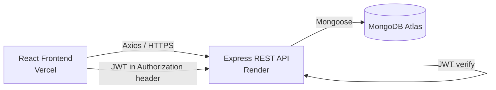

# CivicFix

A full-stack MERN application for reporting and tracking local civic issues — potholes, garbage overflow, broken streetlights, and more — with citizen and admin roles.


---

## About

CivicFix lets citizens report civic problems in their community and track their resolution status. Citizens can upvote and comment on issues to signal community priority, while municipal admins manage a dashboard to acknowledge, prioritize, and resolve reports.

Built end-to-end — database, REST API, authentication, authorization, and a styled React frontend — and deployed to production with a live database, backend, and frontend.

---

## Features

- **Authentication** — secure registration/login with hashed passwords (bcrypt) and JWT-based sessions
- **Role-based authorization** — citizens can manage their own issues; admins can manage any issue and change its status
- **Full issue lifecycle** — create, read, update, delete, with ownership enforced on the backend (not just hidden in the UI)
- **Comments** — threaded discussion on each issue
- **Upvoting** — toggleable upvotes per user, per issue
- **Admin dashboard** — table view of all issues with inline status controls
- **Responsive UI** — built with Tailwind CSS

---

## Tech Stack

**Frontend:** React, Vite, React Router, Axios, Tailwind CSS
**Backend:** Node.js, Express, MongoDB, Mongoose
**Auth & Security:** JWT, bcrypt, Helmet, express-rate-limit, CORS
**Deployment:** Vercel (frontend), Render (backend), MongoDB Atlas (database)

---

## Architecture



**Request flow (e.g. creating an issue):**
User submits form
↓
React sends POST /api/issues with JWT in Authorization header
↓
Express receives request → CORS check → protect middleware verifies JWT
↓
Controller runs, sets reportedBy = authenticated user's ID
↓
Mongoose validates + saves document to MongoDB Atlas
↓
Response sent back → React updates UI


---

## API Endpoints

### Auth — `/api/auth`

| Method | Endpoint | Access | Description |
|---|---|---|---|
| POST | `/api/auth/register` | Public | Create a new account |
| POST | `/api/auth/login` | Public | Log in, returns JWT |
| GET | `/api/auth/me` | Protected | Get current user's profile |

### Issues — `/api/issues`

| Method | Endpoint | Access | Description |
|---|---|---|---|
| POST | `/api/issues` | Protected | Create a new issue |
| GET | `/api/issues` | Public | List all issues |
| GET | `/api/issues/:id` | Public | Get one issue (full detail) |
| PUT | `/api/issues/:id` | Protected + owner/admin | Update an issue; only admin can change `status` |
| DELETE | `/api/issues/:id` | Protected + owner/admin | Delete an issue |
| POST | `/api/issues/:id/comments` | Protected | Add a comment |
| POST | `/api/issues/:id/upvote` | Protected | Toggle upvote |

---

## Running Locally

### Prerequisites
Node.js, npm, MongoDB Atlas account (or local MongoDB)

### Backend
```bash
cd server
npm install
```
Create `server/.env`:
```env
MONGO_URI=your_mongodb_connection_string
JWT_SECRET=your_random_secret
PORT=5001
NODE_ENV=development
CLIENT_URL=http://localhost:5173
```
```bash
npm run dev
```

### Frontend
```bash
cd client
npm install
```
Create `client/.env`:
```env
VITE_API_URL=http://localhost:5001/api
```
```bash
npm run dev
```

---

## Security

- Passwords hashed with **bcrypt**, never stored or returned in plain text
- **JWT** authentication with 7-day expiration
- **Ownership + role-based authorization** enforced on the backend for every mutation, not just hidden in the UI
- **Helmet** for secure HTTP headers
- **Rate limiting** on auth routes to slow brute-force login attempts
- **CORS** locked to a specific origin in production
- Generic error messages on login (no user-enumeration leakage)
- Server-side email/URL validation

---

## What I'd Improve With More Time

- Move JWT storage from `localStorage` to **httpOnly cookies** — `localStorage` is vulnerable to XSS-based token theft; cookies inaccessible to JavaScript would be the more production-grade choice
- Add **automated tests** (currently tested manually and thoroughly via Postman and manual UI walkthroughs at every step)
- Add real **image upload** for issues (currently a plain URL text field) using something like Cloudinary or S3
- Add **pagination** to the issues feed for scalability as data grows
- Extract repeated UI patterns (like status badge styling) into shared, reusable components more consistently

---

## Author

Built by Shashwat Vaidya as an end-to-end learning project covering the full MERN stack, from database design through production deployment.
